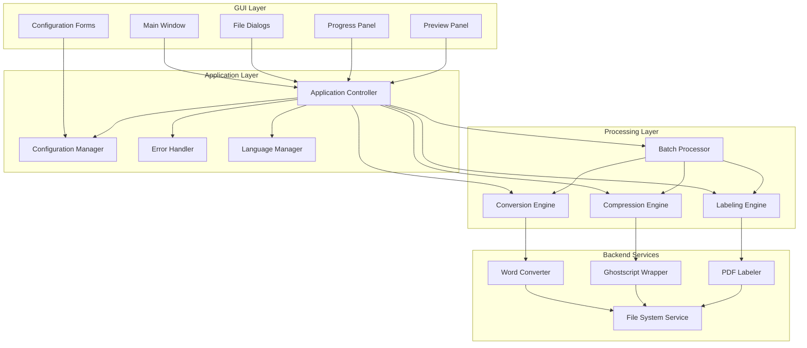

# Design Document: Document Processor GUI

## Overview

The Document Processor GUI is a desktop application that transforms existing command-line PDF processing tools into a unified, user-friendly graphical interface. The application provides three core document processing functions: Word-to-PDF conversion with image compression, PDF compression using Ghostscript, and PDF labeling with filenames.

The design follows a modular architecture with clear separation between the GUI layer, business logic, and backend processing engines. The application will be built using Python with tkinter for the GUI framework, leveraging existing Python libraries for document processing while maintaining cross-platform compatibility.

## Architecture

### High-Level Architecture



### Technology Stack

- **GUI Framework**: tkinter (built-in with Python, cross-platform, lightweight)
- **Word to PDF Conversion**: docx2pdf library with fallback to python-docx + reportlab
- **PDF Processing**: PyMuPDF (fitz) for PDF manipulation and preview generation
- **PDF Compression**: Ghostscript via subprocess calls
- **Configuration**: JSON-based configuration files
- **Internationalization**: Custom translation system with JSON language files
- **Threading**: Python threading for non-blocking operations

## Components and Interfaces

### GUI Components

#### Main Window (MainWindow)
```python
class MainWindow:
    def __init__(self):
        # Initialize main window with tabbed interface
        pass
    
    def create_conversion_tab(self) -> ConversionTab
    def create_compression_tab(self) -> CompressionTab  
    def create_labeling_tab(self) -> LabelingTab
    def show_progress_dialog(self, operation: str) -> ProgressDialog
    def show_settings_dialog(self) -> SettingsDialog
```

#### File Selection Components
```python
class FileSelector:
    def select_files(self, file_types: List[str]) -> List[str]
    def select_folder(self) -> str
    def add_drag_drop_support(self, widget: tk.Widget)
    
class FileListWidget:
    def add_files(self, files: List[str])
    def remove_selected_files()
    def get_file_list(self) -> List[str]
    def clear_list()
```

#### Progress and Feedback Components
```python
class ProgressDialog:
    def update_progress(self, percentage: int, message: str)
    def update_batch_progress(self, current: int, total: int)
    def show_completion_message(self, results: ProcessingResults)
    def enable_cancellation(self, callback: Callable)

class ErrorDialog:
    def show_error(self, error: Exception, context: str)
    def show_warning(self, message: str)
    def show_info(self, message: str)
```

### Application Layer Components

#### Application Controller
```python
class ApplicationController:
    def __init__(self, config_manager: ConfigurationManager):
        self.config_manager = config_manager
        self.error_handler = ErrorHandler()
        self.language_manager = LanguageManager()
    
    def process_word_to_pdf(self, files: List[str], settings: ConversionSettings) -> ProcessingResults
    def process_pdf_compression(self, files: List[str], settings: CompressionSettings) -> ProcessingResults
    def process_pdf_labeling(self, files: List[str], settings: LabelingSettings) -> ProcessingResults
    def cancel_current_operation()
```

#### Configuration Manager
```python
class ConfigurationManager:
    def load_config(self) -> AppConfig
    def save_config(self, config: AppConfig)
    def get_default_config(self) -> AppConfig
    def validate_config(self, config: AppConfig) -> bool

@dataclass
class AppConfig:
    language: str
    default_input_dir: str
    default_output_dir: str
    compression_quality: str
    image_compression_enabled: bool
    label_position: str
    label_font_size: int
    remember_window_size: bool
```

### Processing Layer Components

#### Conversion Engine
```python
class ConversionEngine:
    def __init__(self, word_converter: WordConverter):
        self.word_converter = word_converter
    
    def convert_files(self, files: List[str], settings: ConversionSettings, 
                     progress_callback: Callable) -> ProcessingResults
    def validate_input_files(self, files: List[str]) -> ValidationResult

@dataclass
class ConversionSettings:
    output_directory: str
    image_compression: bool
    compression_quality: float
    preserve_formatting: bool
```

#### Compression Engine
```python
class CompressionEngine:
    def __init__(self, ghostscript_wrapper: GhostscriptWrapper):
        self.ghostscript_wrapper = ghostscript_wrapper
    
    def compress_files(self, files: List[str], settings: CompressionSettings,
                      progress_callback: Callable) -> ProcessingResults
    def estimate_compression_ratio(self, file_path: str, quality: str) -> float

@dataclass
class CompressionSettings:
    output_directory: str
    quality_preset: str  # 'screen', 'ebook', 'printer', 'prepress'
    custom_dpi: Optional[int]
    preserve_original: bool
```

#### Labeling Engine
```python
class LabelingEngine:
    def __init__(self, pdf_labeler: PDFLabeler):
        self.pdf_labeler = pdf_labeler
    
    def label_files(self, files: List[str], settings: LabelingSettings,
                   progress_callback: Callable) -> ProcessingResults
    def preview_label_placement(self, file_path: str, settings: LabelingSettings) -> PreviewImage

@dataclass
class LabelingSettings:
    output_directory: str
    label_position: str  # 'header', 'footer', 'top-left', 'top-right', etc.
    font_size: int
    font_color: str
    transparency: float
    include_path: bool
```

### Backend Services

#### Word Converter
```python
class WordConverter:
    def convert_to_pdf(self, input_path: str, output_path: str, 
                      settings: ConversionSettings) -> ConversionResult
    def is_supported_format(self, file_path: str) -> bool
    def get_supported_formats(self) -> List[str]
```

#### Ghostscript Wrapper
```python
class GhostscriptWrapper:
    def __init__(self):
        self.ghostscript_path = self._find_ghostscript()
    
    def compress_pdf(self, input_path: str, output_path: str, 
                    quality: str, custom_dpi: Optional[int] = None) -> CompressionResult
    def is_available(self) -> bool
    def get_version(self) -> str
```

#### PDF Labeler
```python
class PDFLabeler:
    def add_filename_labels(self, input_path: str, output_path: str,
                           settings: LabelingSettings) -> LabelingResult
    def generate_preview(self, input_path: str, settings: LabelingSettings) -> bytes
    def calculate_label_position(self, page_size: Tuple[float, float], 
                               position: str) -> Tuple[float, float]
```

## Data Models

### Core Data Structures

```python
@dataclass
class ProcessingResult:
    success: bool
    input_file: str
    output_file: Optional[str]
    error_message: Optional[str]
    processing_time: float
    file_size_before: int
    file_size_after: Optional[int]

@dataclass
class ProcessingResults:
    results: List[ProcessingResult]
    total_files: int
    successful_files: int
    failed_files: int
    total_processing_time: float
    
    def get_summary(self) -> str
    def get_failed_files(self) -> List[ProcessingResult]

@dataclass
class ValidationResult:
    valid_files: List[str]
    invalid_files: List[Tuple[str, str]]  # (file_path, error_reason)
    
    def is_valid(self) -> bool
    def get_error_summary(self) -> str
```

### Configuration Models

```python
@dataclass
class UISettings:
    window_width: int = 800
    window_height: int = 600
    window_x: Optional[int] = None
    window_y: Optional[int] = None
    theme: str = "default"
    show_preview: bool = True
    preview_size: int = 200

@dataclass
class ProcessingDefaults:
    conversion_quality: float = 0.8
    compression_preset: str = "ebook"
    label_font_size: int = 10
    label_position: str = "footer"
    batch_size: int = 10
    max_concurrent_operations: int = 2
```

## Correctness Properties

*A property is a characteristic or behavior that should hold true across all valid executions of a system-essentially, a formal statement about what the system should do. Properties serve as the bridge between human-readable specifications and machine-verifiable correctness guarantees.*

Before defining the correctness properties, I need to analyze the acceptance criteria from the requirements document to determine which ones are testable as properties.

### Property 1: File Selection and Management
*For any* processing function (conversion, compression, labeling), when files are selected through drag-and-drop or file dialogs, the file list should accurately reflect the selected files and allow addition/removal operations.
**Validates: Requirements 2.3, 2.4**

### Property 2: Settings Persistence
*For any* configuration change (directories, language, compression settings, label formatting), when the application is restarted, the modified settings should be preserved and applied.
**Validates: Requirements 2.5, 4.2, 4.4, 10.4**

### Property 3: Batch Processing with Progress
*For any* batch operation with multiple files, the system should process all files while providing both individual and overall progress indication, and generate a summary report with success/failure counts.
**Validates: Requirements 3.1, 3.2, 3.3, 9.1, 9.3**

### Property 4: Batch Error Handling Independence
*For any* batch operation where some files fail processing, the system should continue processing remaining valid files and report individual results for each file.
**Validates: Requirements 5.3, 5.5, 9.2**

### Property 5: File Format Support
*For any* supported file format (.doc, .docx, .rtf for conversion; .pdf for compression/labeling), the system should successfully process files of that format or provide specific error messages for unsupported variations.
**Validates: Requirements 5.4**

### Property 6: Compression Quality Application
*For any* PDF compression operation with specified quality settings, the output file size should be reduced according to the quality level, with higher compression resulting in smaller files.
**Validates: Requirements 5.2, 6.1**

### Property 7: File Preservation and Naming
*For any* processing operation, the original files should remain unchanged and new files should be created with appropriate naming conventions that clearly indicate the operation performed.
**Validates: Requirements 6.4, 7.5**

### Property 8: Label Application Consistency
*For any* PDF labeling operation, filename labels should appear on all pages of the document with consistent formatting as specified in the configuration.
**Validates: Requirements 7.1, 7.4**

### Property 9: Preview Generation
*For any* document selected for processing, if preview generation is possible, thumbnail previews should be displayed; if not possible, appropriate placeholder messages should be shown.
**Validates: Requirements 8.1, 8.5**

### Property 10: Language Switching Completeness
*For any* language change between Chinese and English, all interface elements (menus, buttons, messages, help text) should immediately update to the selected language without requiring application restart.
**Validates: Requirements 10.1, 10.2, 10.3**

### Property 11: Error Handling and Recovery
*For any* error condition (file access, processing failure, resource shortage), the system should provide specific error messages, log detailed information, and maintain application stability without crashing.
**Validates: Requirements 11.1, 11.2, 11.3**

### Property 12: Input Validation
*For any* file selected for processing, the system should validate file format, accessibility, and basic integrity before beginning processing operations.
**Validates: Requirements 11.4**

## Error Handling

### Error Categories and Handling Strategies

#### File System Errors
- **File Access Denied**: Display specific error with suggestions (check permissions, close file in other applications)
- **File Not Found**: Validate file existence before processing, remove missing files from batch
- **Disk Space Insufficient**: Check available space before operations, suggest cleanup or alternative location
- **Path Too Long**: Validate path lengths, suggest shorter output paths or file names

#### Processing Errors
- **Conversion Failures**: Log specific error details, continue with remaining files in batch
- **Compression Failures**: Handle cases where compression increases file size, offer user choice
- **Labeling Failures**: Validate PDF structure before labeling, handle corrupted PDFs gracefully
- **Ghostscript Errors**: Detect Ghostscript availability, provide installation guidance if missing

#### Configuration Errors
- **Invalid Settings**: Validate configuration values, reset to defaults if corrupted
- **Missing Dependencies**: Check for required libraries/tools, provide installation instructions
- **Permission Issues**: Handle cases where config files cannot be written, use temporary settings

#### User Interface Errors
- **Preview Generation Failures**: Show placeholder images, log errors for debugging
- **Language Loading Errors**: Fall back to English if translation files are missing/corrupted
- **Theme/Display Issues**: Provide fallback UI elements, handle high DPI displays

### Error Recovery Mechanisms

```python
class ErrorRecoveryManager:
    def handle_processing_error(self, error: ProcessingError, context: ProcessingContext) -> RecoveryAction
    def attempt_automatic_recovery(self, error: Exception) -> bool
    def log_error_for_support(self, error: Exception, user_context: dict)
    def suggest_user_actions(self, error: Exception) -> List[str]
```

## Testing Strategy

### Dual Testing Approach

The testing strategy employs both unit testing and property-based testing to ensure comprehensive coverage:

**Unit Tests** focus on:
- Specific examples and edge cases for each component
- Integration points between GUI and processing layers
- Error conditions and boundary cases
- Configuration loading and validation
- File format support verification

**Property-Based Tests** focus on:
- Universal properties that hold across all valid inputs
- Comprehensive input coverage through randomization
- Batch processing behavior with various file combinations
- Settings persistence across application restarts
- Language switching completeness

### Property-Based Testing Configuration

- **Framework**: Hypothesis for Python property-based testing
- **Test Iterations**: Minimum 100 iterations per property test
- **Test Tagging**: Each property test tagged with format: **Feature: document-processor-gui, Property {number}: {property_text}**
- **Data Generation**: Custom generators for file paths, settings combinations, and document content

### Unit Testing Focus Areas

#### GUI Component Testing
- Widget creation and layout validation
- Event handling and user interaction
- Dialog behavior and modal operations
- Progress indication accuracy

#### Processing Engine Testing
- Individual conversion operations with known inputs
- Compression ratio validation with test files
- Label placement accuracy with sample PDFs
- Error handling with intentionally corrupted files

#### Configuration Testing
- Settings serialization/deserialization
- Default value validation
- Migration between configuration versions
- Language file loading and fallback behavior

### Integration Testing

#### End-to-End Workflows
- Complete document processing workflows from file selection to output
- Batch processing with mixed file types and sizes
- Error recovery scenarios with partial batch failures
- Configuration changes affecting ongoing operations

#### Cross-Platform Testing
- File path handling on Windows, macOS, and Linux
- Font rendering and UI scaling on different displays
- Ghostscript integration across operating systems
- File permission handling variations

### Performance Testing

#### Scalability Testing
- Batch processing with large numbers of files (100+ documents)
- Memory usage monitoring during large file processing
- UI responsiveness during background operations
- Concurrent operation handling

#### Resource Usage Testing
- Memory leak detection during extended use
- CPU usage optimization for compression operations
- Disk space management during batch processing
- Network resource usage (if applicable for future features)

### Test Data Management

#### Test File Generation
- Automated generation of test documents in various formats
- Corrupted file creation for error handling tests
- Large file generation for performance testing
- Multi-language content for internationalization testing

#### Test Environment Setup
- Isolated test directories for file operations
- Mock Ghostscript installations for testing
- Simulated low-resource conditions
- Multiple language environment configurations